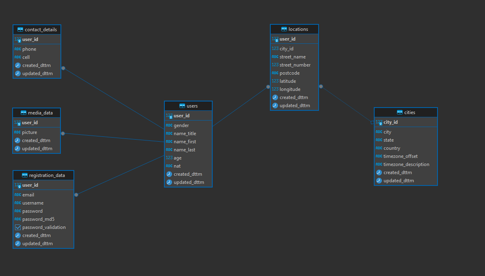

# Pet project for DE (1-st step)


#### Стек: `Python`, `Git`, `Docker`, `Postgres`

Разработать интерфейс для взаимодействия с [API](./docs/pages/api.md), получения N-пользователей,
далее у полученных пользователей проверять сложность пароля и автоматически заносить в БД.



## Требования
### 1. Ссылка на API может меняться.

### 2. Проверять валидность email

```
aynz.khrymy@example.com
```

### 3. Проверять валидность пароля

Пароль должен содержать:
```
upper      ABCDEFGHIJKLMNOPQRSTUVWXYZ
lower      abcdefghijklmnopqrstuvwxyz
number     0123456789
special    !"#$%&'()*+,- ./:;<=>?@[\]^_`{|}~
```

В БД ставить отметку валидатора в таблицу `registration_data` имя атрибута `password_validation`

### 3. Написать CRUD's:
- для создания схемы БД
- вести ограничения по для таблицы cities - атрибуты city, state, country должны быть уникальными
- для записи полученных данных из API в БД, в соответствии со схемой целевого хранилища
  - проверять есть ли такой email в БД
- для получения списка пользователей с валидным/не валидным паролем
